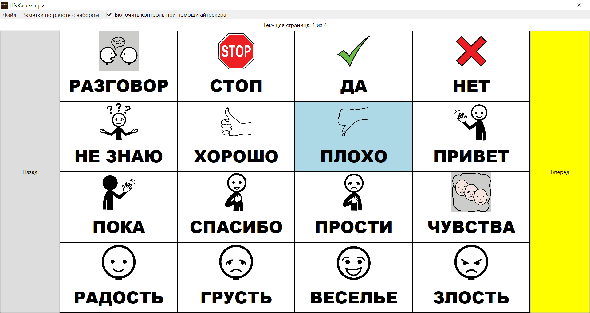
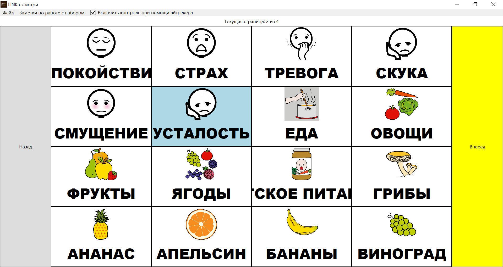
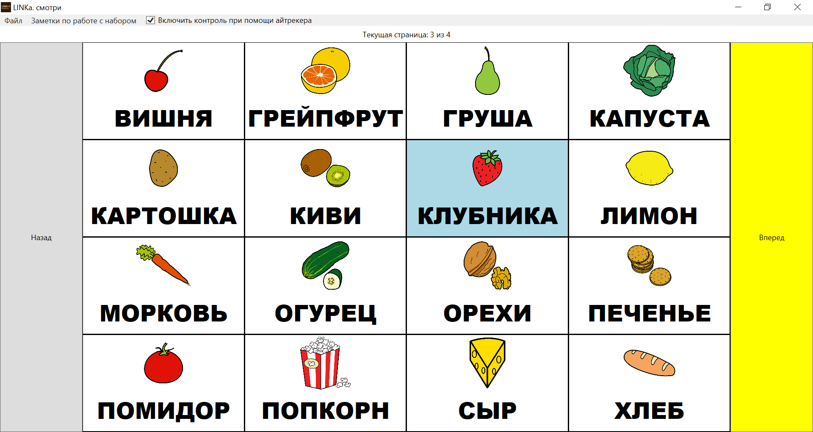
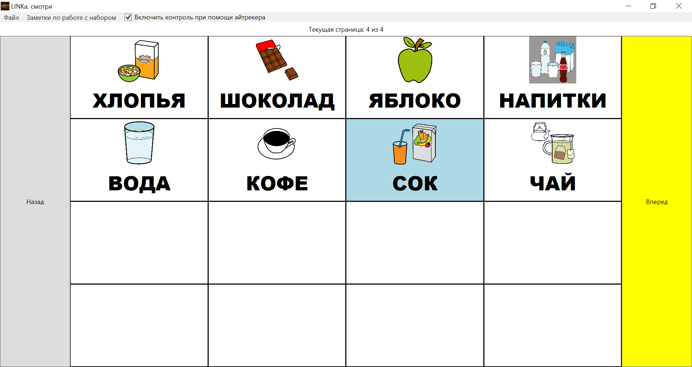

# Генератор карточек для LINKa

Здесь расположены __ruby-скрипты__, которые генерирует _.linka_-карточки для программы __"LINKa. смотри"__ <https://linka.su/looks/>. Исходники оригинальной программы —  <https://github.com/linkasu/LINKa.look-windows>. Мой форк (в котором нету функции редактора, который слишком плохо работал в оригинальной программе) — <https://github.com/pasha-liubetski/LINKa.look-windows>.

На данный момент скрипты проверены только в OS Linux. Для работы нужен интерпретатор ruby и установленный __TTS__-синтезатор rhvoice.

Встроенный в программу интерактивный редактор карточек содержит много багов, так что для того, чтобы создавать наборы карточек, мне показалось проще написать эти скрипты.






## Идея

Наборы карточек для LINKa — это обычные zip-файлы следующей структуры:

```
~/linka_gen # unzip -l example.linka 
Archive:  example.linka
  Length      Date    Time    Name
---------  ---------- -----   ----
     1332  2022-07-26 12:13   config.json
  1014167  2022-07-26 12:13   вода.png
    22124  2022-07-26 12:13   вода.wav
   661951  2022-07-26 12:13   кофе.png
    25484  2022-07-26 12:13   кофе.wav
   753234  2022-07-26 12:13   напитки.png
    31724  2022-07-26 12:13   напитки.wav
  1392329  2022-07-26 12:13   сок.png
    21884  2022-07-26 12:13   сок.wav
  1329307  2022-07-26 12:13   чай.png
    19964  2022-07-26 12:13   чай.wav
  1909342  2022-07-26 12:13   шоколад.png
    34364  2022-07-26 12:13   шоколад.wav
---------                     -------
  7217206                     13 files
~/linka_gen #
```

Внутри расположены `.png-файлы` изображений, `.wav-файлы` аудио и `.json-файл` с конфигурацией и описанием набора карточек. Важно, чтобы имена файлов внутри zip-архива были в кодировке UTF-8.

Скрипт `gen_linka_board.rb` облегчает работу создание такого архива.

## Использование

1. В директории `src` следует расположить файл `config.yaml` и `png` файлы изображений.

```
~/linka_gen # ls src 
config.yaml  вода.png  кофе.png  напитки.png  сок.png  чай.png  шоколад.png
```

2. После этого мы можем запустить скрипт `gen_linka_board.rb`

```
~/linka_gen # ./gen_linka_board.rb 
Reading config.yaml...
Parsing cards description...
Deleting old out_dir...
Writing config.json...
Creating .wav files via RHVoice...
echo НАПИТКИ | RHVoice-test -R 44100 -p anna -o out_dir/напитки.wav
echo ВОДА | RHVoice-test -R 44100 -p anna -o out_dir/вода.wav
echo КОФЕ | RHVoice-test -R 44100 -p anna -o out_dir/кофе.wav
echo СОК | RHVoice-test -R 44100 -p anna -o out_dir/сок.wav
echo ЧАЙ | RHVoice-test -R 44100 -p anna -o out_dir/чай.wav
echo ШОКОЛАД | RHVoice-test -R 44100 -p anna -o out_dir/шоколад.wav
Copying png files...
Creating .zip file
  adding: config.json (deflated 62%)
  adding: вода.png (deflated 9%)
  adding: вода.wav (deflated 15%)
  adding: кофе.png (deflated 19%)
  adding: кофе.wav (deflated 20%)
  adding: напитки.png (deflated 4%)
  adding: напитки.wav (deflated 19%)
  adding: сок.png (deflated 7%)
  adding: сок.wav (deflated 24%)
  adding: чай.png (deflated 5%)
  adding: чай.wav (deflated 19%)
  adding: шоколад.png (deflated 4%)
  adding: шоколад.wav (deflated 20%)
~/linka_gen # 
```

3. На основе `config.yaml` в директории `out_dir` создаётся файл `config.json`.
4. Карточки озвучиваются с помощью __RHVoice__ (.wav-файлы расположены тоже в директории `out_dir`).
5. `.png`-файлы просто копируются в `out_dir`.
6. Далее содержимое `out_dir` архивируется в `zip`-архив `example.linka`

Скрипт `ls_pngs_yaml.rb` выводит список `.png`-файлов с подписями в виде, пригодном для того, чтобы копировать-вставить в файл `src/config.yaml`:

```
~/linka_gen # ./ls_pngs_yaml.rb 
cards:
  - title: ВОДА
    png: вода.png
  - title: КОФЕ
    png: кофе.png
  - title: НАПИТКИ
    png: напитки.png
  - title: СОК
    png: сок.png
  - title: ЧАЙ
    png: чай.png
  - title: ШОКОЛАД
    png: шоколад.png
~/linka_gen # 
```

Подписи ­— это поле `title`, его можно отредактировать, сами элементы списка можно расположить в другом порядке.

Пример файла `config.yaml`:

```yaml
version: "1.2"
withoutSpace: false
directSet: false
description: |
  Набор карточек "Напитки". Автор — Паша Любецкий <pasha.liubetski@yandex.com>
  Лицензия — Creative Commons License BY-NC-SA.
  
  Изображения — https://arasaac.org/pictograms/search, лицензия — Creative Commons License BY-NC-SA.
columns: 3
rows: 2
cards:
  - title: НАПИТКИ
    png: напитки.png
  - title: ВОДА
    png: вода.png
  - title: КОФЕ
    png: кофе.png
  - title: СОК
    png: сок.png
  - title: ЧАЙ
    png: чай.png
  - title: ШОКОЛАД
    png: шоколад.png
```

В поле 'description' расположено текстовое описание набора карточек, поле 'columns' означает число столбцов в наборе карточек, поле 'rows' - число строк.

## Лицензия

Автор скриптов — Паша Любецкий ([pasha.liubetski@yandex.com](mailto:pasha.liubetski@yandex.com)), лицензия — _Creative Commons Attribution 4.0 International (CC-BY 4.0)_.

Изображения — __ARASAAC__ (<https://arasaac.org/pictograms/search>), лицензия — _Creative Commons License BY-NC-SA_.
